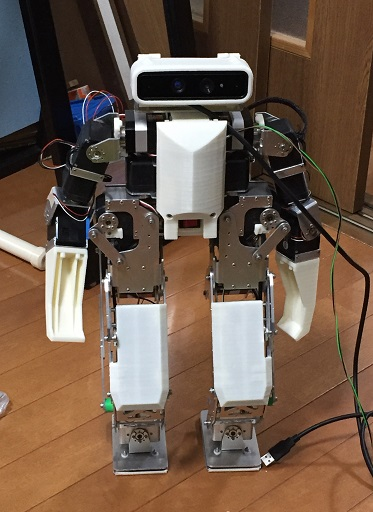

# Lambda_zmp_walk-STM32F4
このプログラムは二足歩行ロボットの歩容生成プログラムです。
梶田秀司博士著「ヒューマノイドロボット」に掲載されている、ZMPを規範とした歩容生成法の、オンライン生成と動力学フィルターを実装しました。

[ヒューマノイドロボット]: https://www.ohmsha.co.jp/book/9784274200588/ "ヒューマノイドロボット"

「ヒューマノイドロボット」という本は人型ロボットの開発の基礎を勉強するうえで非常に素晴らしい本ですが、ZMPを使った歩容生成の辺りから急激に難しくなり、初心者には理解が困難になります。
このプログラムではその部分の実装の一例を示しています。
また、本では数式が示されているに留まっていますが、実用のための仕組み（連続歩行や、方向変換などなど）も実装しています。

# License
MIT License

Copyright (c) 2018 Kenji Shimada

以下に定める条件に従い、本ソフトウェアおよび関連文書のファイル（以下「ソフトウェア」）の複製を取得するすべての人に対し、ソフトウェアを無制限に扱うことを無償で許可します。これには、ソフトウェアの複製を使用、複写、変更、結合、掲載、頒布、サブライセンス、および/または販売する権利、およびソフトウェアを提供する相手に同じことを許可する権利も無制限に含まれます。 
上記の著作権表示および本許諾表示を、ソフトウェアのすべての複製または重要な部分に記載するものとします。 
ソフトウェアは「現状のまま」で、明示であるか暗黙であるかを問わず、何らの保証もなく提供されます。ここでいう保証とは、商品性、特定の目的への適合性、および権利非侵害についての保証も含みますが、それに限定されるものではありません。 作者または著作権者は、契約行為、不法行為、またはそれ以外であろうと、ソフトウェアに起因または関連し、あるいはソフトウェアの使用またはその他の扱いによって生じる一切の請求、損害、その他の義務について何らの責任も負わないものとします。 

# Lambda「ラムダ」

ラムダはロボットの歩行を研究するために開発された小型ロボットです。
アクチュエータとしてはホビーロボット用のサーボモーターを使用しています。
このロボットの足関節構造は特殊な構造をしています。
追々この足構造についての情報も公開していく予定です。

# Usage
UARTに接続したコンソールで操作します。
上位CPUとの通信もこのUARTを使います。立ち上がった際に特定のFLASH領域を確認し、CPUとつながっているかコンソールとつながっているかを判断します。

まず、ロボットの下半身（足）をオンにします。

\> lbp default 1 20 　←　デフォルトパラメータでオンにします。
 
 もしくは
 
\> lbp 106.8 0 320 0 1 20 　←　パラメータを指定してオンにします。足幅=106.8mm ストライド=0mm 股関節までの高さ=320mm 遊脚の足上げ=0mm 重心補正有り 動作速度（大きい方が遅い）=20cycles(0.02sec/cycle)

次に上半身（腕）をオンにします。

\> ubp default 20

次にロボットを歩かせます。

\> zmp 0  　←　ロボットをデフォルトパラメータで直進歩行させる。
 
 もしくは
 
\> zmp 0 70 0.5 10  ← パラメータを指定して歩かせます。モード=0(直進) 歩幅=70mm ペース=0.5秒 歩数=10歩 
 
 歩行を継続したい場合は、 
 
\> cont ( c でもよい)

 or
 
\> cont 1   ←　デフォルト値でカーブ歩行で継続

 or
 
\> cont 1 70 0.4 10　←　設定したパラメータ値で歩行継続　カーブ　歩幅70mm　ペース0.4秒　歩数10歩

歩行を停止したい場合は、

\> stop ( s でもよい)

